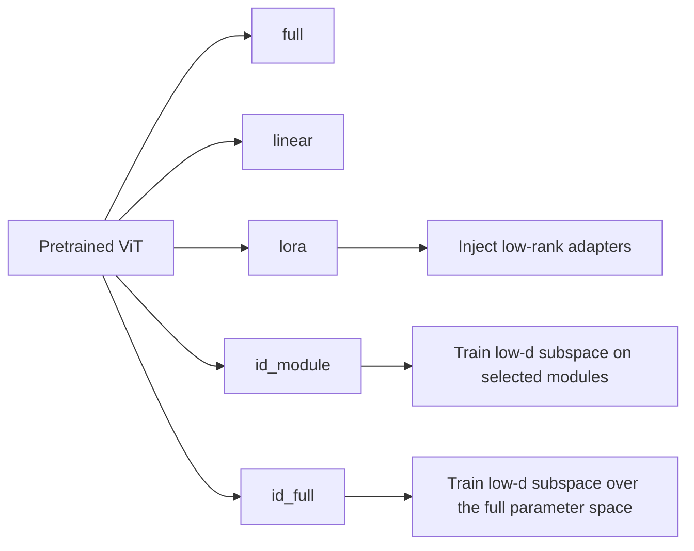
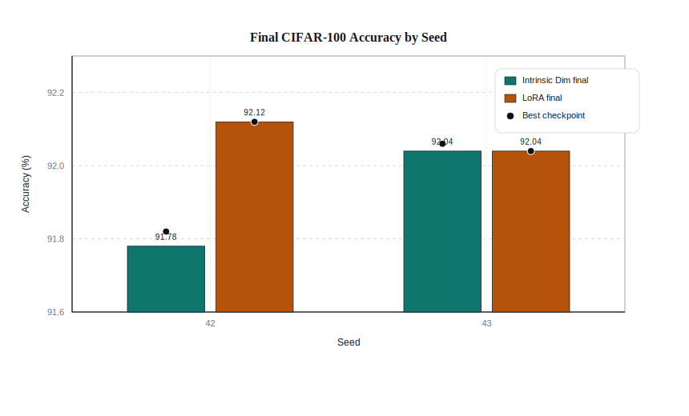
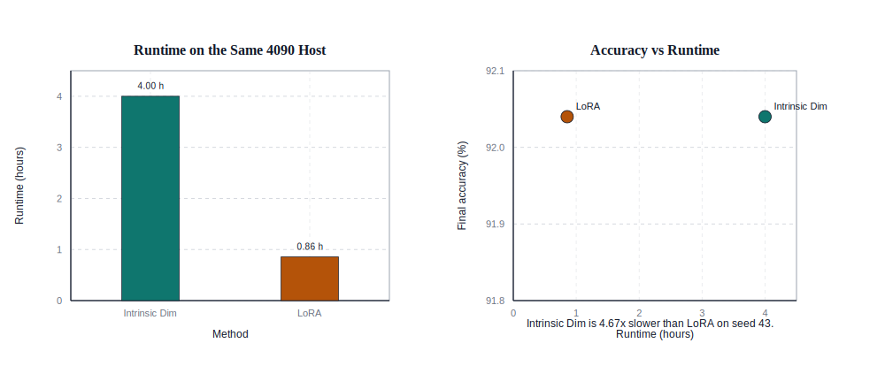
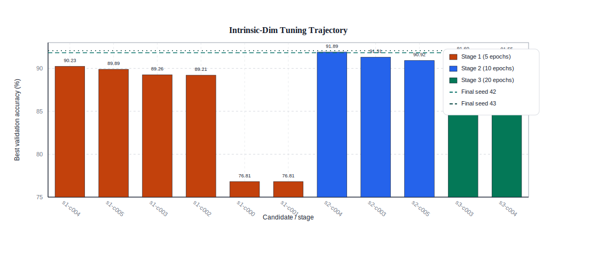

# ViT + LoRA + Intrinsic Dimension


PyTorch research repo for comparing full fine-tuning, linear probing, LoRA, and intrinsic-dimension tuning on Vision Transformers.

The main question is simple: under a similar trainable-parameter budget, how close can LoRA and random subspace tuning get to full fine-tuning?

## Setup

```bash
python -m venv .venv
# Windows
.venv\Scripts\activate
# macOS / Linux
# source .venv/bin/activate

pip install -r requirements.txt
```

For older environments, `requirements.vit_py37.txt` is also included.

## Quick Start

Compatibility check:

```bash
python test_compatibility.py
```

Smoke test:

```bash
python scripts/test_vit_intrinsic_pipeline.py \
  --model_name vit_tiny_patch16_224 \
  --modes full,linear,lora,id_module,id_full \
  --epochs 1 \
  --num_batches 2
```

Preview the full experiment plan:

```bash
python scripts/run_vit_intrinsic_plan.py --phase all --dry_run
```

Run one experiment:

```bash
python experiments/vit_intrinsic_lora.py \
  --mode lora \
  --dataset cifar100 \
  --model_name vit_base_patch16_224 \
  --lora_scope qkvo \
  --lora_rank 8 \
  --lora_alpha 16
```

Main modes are `full`, `linear`, `lora`, `id_module`, and `id_full`.

## Implementation Focus

- `experiments/vit_intrinsic_lora.py` is the central runner for all training modes
- LoRA is injected into timm ViT attention layers
- intrinsic-dimension tuning is handled by `SubspaceModel`, with dense, sparse, and Fastfood projections
- the code supports CIFAR-100 and Flowers-102 transfer experiments
- practical features include dry-run planning, smoke tests, gradient accumulation, and optional gradient checkpointing for limited-VRAM GPUs

## Key Files

- `experiments/vit_intrinsic_lora.py`: single-run experiments
- `scripts/run_vit_intrinsic_plan.py`: unattended multi-run plans
- `scripts/test_vit_intrinsic_pipeline.py`: smoke test
- `src/models/lora.py`: LoRA wrappers
- `src/models/subspace.py`: intrinsic-dimension wrapper
- `scripts/visualize_final_results.py`: pure-Python SVG figure generator for the final CIFAR-100 study

## Visual Summary



This is the comparison the repository is built around: keep the same base ViT, then vary how many parameters are trainable and where adaptation happens. In practice, LoRA and intrinsic-dimension modes are the parameter-efficient branches, and Fastfood is the practical projection choice for larger ID runs.

## CIFAR-100 Final Study

The final controlled comparison uses `vit_base_patch16_224` on `CIFAR-100`, with both parameter-efficient methods constrained to about `666,724` trainable parameters and evaluated on seeds `42` and `43`.

| Method | Mean final acc. | Mean best acc. | Trainable params | Fair runtime (seed 43) |
| --- | ---: | ---: | ---: | ---: |
| Intrinsic Dim | 91.91 | 91.94 | 666,724 | 4.00 h |
| LoRA | 92.08 | 92.08 | 666,724 | 0.86 h |

Key takeaways:

- LoRA is only `0.17` points higher in mean final accuracy.
- Intrinsic-dim remains competitive at the same parameter budget.
- The main practical gap is runtime: on the same 4090 host, intrinsic-dim is about `4.67x` slower.
- The early failed `d=371812` run was a configuration issue, not evidence that the method is inherently broken.

### Key Figures



Final accuracy remains tightly matched across both seeds.



Runtime, not accuracy, is where LoRA separates itself in practice.



The tuning trajectory shows why the final intrinsic-dim result should be interpreted as a tuned configuration rather than an untuned baseline.

A full write-up with all charts and methodological notes is in [docs/final_cifar100_analysis.md](docs/final_cifar100_analysis.md).

## Reproduce the Figures

The committed charts are generated directly from the saved experiment JSON files and do not require Matplotlib:

```bash
python3 scripts/visualize_final_results.py
```

Outputs are written to `docs/figures/final_analysis/`.

## License

MIT
