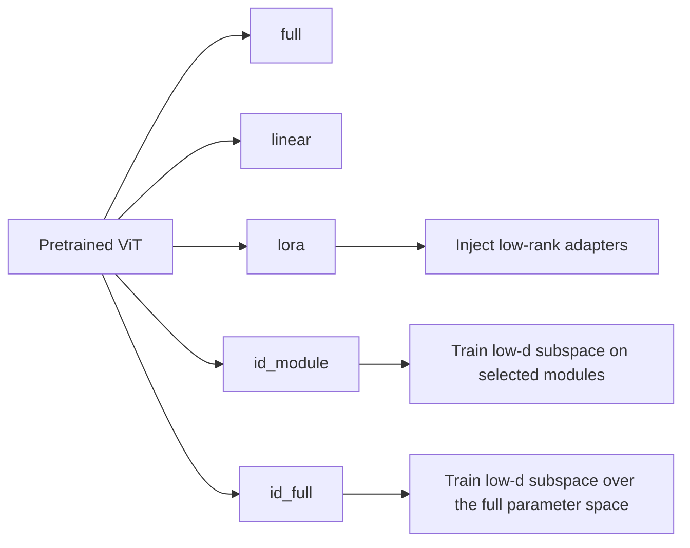

# ViT + LoRA + Intrinsic Dimension


PyTorch research repo for comparing full fine-tuning, linear probing, LoRA, and intrinsic-dimension tuning on Vision Transformers.

The main question is simple: under a similar trainable-parameter budget, how close can LoRA and random subspace tuning get to full fine-tuning?

## Setup

```bash
python -m venv .venv
# Windows
.venv\Scripts\activate
# macOS / Linux
# source .venv/bin/activate

pip install -r requirements.txt
```

For older environments, `requirements.vit_py37.txt` is also included.

## Quick Start

Compatibility check:

```bash
python test_compatibility.py
```

Smoke test:

```bash
python scripts/test_vit_intrinsic_pipeline.py \
  --model_name vit_tiny_patch16_224 \
  --modes full,linear,lora,id_module,id_full \
  --epochs 1 \
  --num_batches 2
```

Preview the full experiment plan:

```bash
python scripts/run_vit_intrinsic_plan.py --phase all --dry_run
```

Run one experiment:

```bash
python experiments/vit_intrinsic_lora.py \
  --mode lora \
  --dataset cifar100 \
  --model_name vit_base_patch16_224 \
  --lora_scope qkvo \
  --lora_rank 8 \
  --lora_alpha 16
```

Main modes are `full`, `linear`, `lora`, `id_module`, and `id_full`.

## Implementation Focus

- `experiments/vit_intrinsic_lora.py` is the central runner for all training modes
- LoRA is injected into timm ViT attention layers
- intrinsic-dimension tuning is handled by `SubspaceModel`, with dense, sparse, and Fastfood projections
- the code supports CIFAR-100 and Flowers-102 transfer experiments
- practical features include dry-run planning, smoke tests, gradient accumulation, and optional gradient checkpointing for limited-VRAM GPUs

## Key Files

- `experiments/vit_intrinsic_lora.py`: single-run experiments
- `scripts/run_vit_intrinsic_plan.py`: unattended multi-run plans
- `scripts/test_vit_intrinsic_pipeline.py`: smoke test
- `src/models/lora.py`: LoRA wrappers
- `src/models/subspace.py`: intrinsic-dimension wrapper

## Visual Summary



This is the comparison the repository is built around: keep the same base ViT, then vary how many parameters are trainable and where adaptation happens. In practice, LoRA and intrinsic-dimension modes are the parameter-efficient branches, and Fastfood is the practical projection choice for larger ID runs.

## License

MIT
