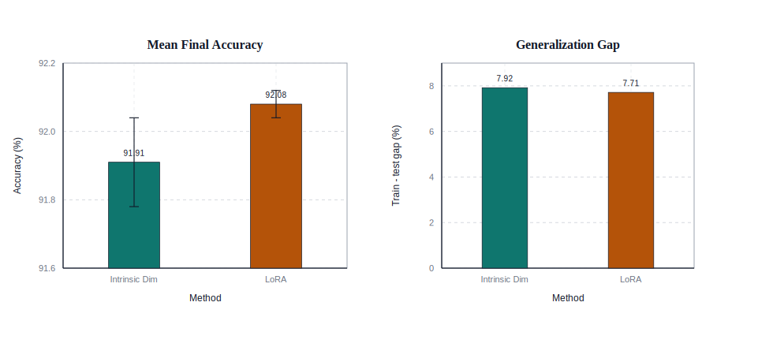
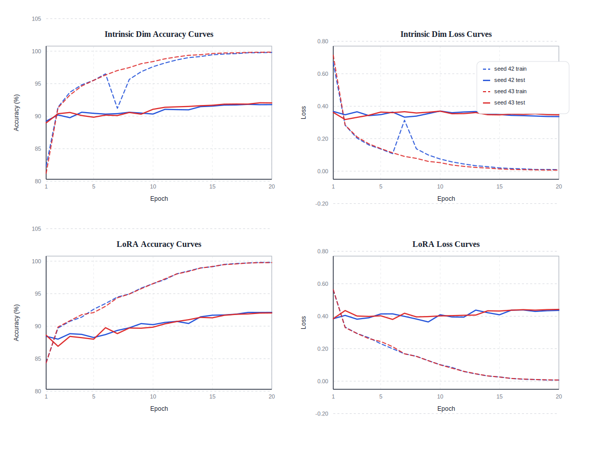
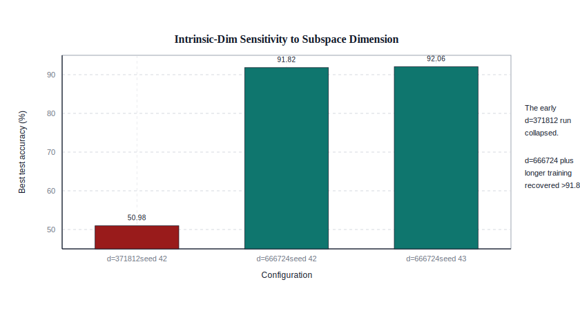

# Final CIFAR-100 Analysis: Intrinsic-Dim vs LoRA

## Study Design

This analysis focuses on the final parameter-matched comparison in the repository:

- Backbone: `vit_base_patch16_224`
- Dataset: `CIFAR-100`
- Methods: `id_module` with Fastfood projection vs `lora`
- Trainable-parameter budget: about `666,724`
- Seeds: `42`, `43`
- Objective: compare final accuracy, optimization behavior, and runtime under the same parameter budget

The relevant raw outputs are stored under `results/vit_intrinsic/cifar100/` and the committed figures are regenerated by `scripts/visualize_final_results.py`.

## Final Comparison

### Per-run Results

| Method | Seed | Best test acc. | Final test acc. | Final train acc. | Generalization gap | Runtime | Notes |
| --- | ---: | ---: | ---: | ---: | ---: | ---: | --- |
| Intrinsic Dim | 42 | 91.82 | 91.78 | 99.81 | 8.03 | 25.15 h | resumed across local + cloud; exclude from fair runtime comparison |
| Intrinsic Dim | 43 | 92.06 | 92.04 | 99.85 | 7.81 | 4.00 h | fair same-host runtime |
| LoRA | 42 | 92.12 | 92.12 | 99.80 | 7.68 | 0.87 h | single-host run |
| LoRA | 43 | 92.04 | 92.04 | 99.79 | 7.75 | 0.86 h | fair same-host runtime |

### Mean Summary

| Method | Mean best acc. | Mean final acc. | Std. final acc. | Mean gap | Trainable params |
| --- | ---: | ---: | ---: | ---: | ---: |
| Intrinsic Dim | 91.94 | 91.91 | 0.13 | 7.92 | 666,724 |
| LoRA | 92.08 | 92.08 | 0.04 | 7.71 | 666,724 |

## Figure 1: Final Accuracy by Seed


Interpretation:

- The two methods are effectively tied on this task.
- LoRA is slightly higher on seed `42`, while intrinsic-dim slightly leads on seed `43` in best-checkpoint accuracy.
- The mean final-accuracy gap is only `0.17` points in favor of LoRA.

## Figure 2: Mean Accuracy and Generalization Gap



Interpretation:

- The final-accuracy means are nearly identical once the parameter budget is matched.
- Generalization gaps are also close (`7.92` vs `7.71`), so this study does not support a claim that either method has a strong regularization advantage.
- The main difference is not overfitting behavior; it is optimization efficiency.

## Figure 3: Runtime Tradeoff on a Fair Host-Matched Run


Interpretation:

- The fair runtime comparison should use `seed 43`, because both methods were run from scratch on the same cloud 4090 setup.
- Under that fair comparison, intrinsic-dim took `4.00 h`, while LoRA took `0.86 h`.
- That is a `4.67x` slowdown for intrinsic-dim, even though accuracy stayed in the same `~92%` band.
- This is the clearest explanation for why LoRA dominates practical PEFT usage despite the strong intrinsic-dim result.

## Figure 4: Learning Curves



Interpretation:

- LoRA climbs into the strong-accuracy regime earlier.
- Intrinsic-dim converges more slowly but eventually reaches the same neighborhood.
- The final comparison is therefore best framed as an **accuracy-efficiency tradeoff**, not a pure accuracy gap.

## Figure 5: Intrinsic-Dim Tuning Trajectory


Interpretation:

- The final intrinsic-dim result should not be compared against the first failed run in isolation.
- Stage-wise tuning shows a clear path from the low `~76-77%` regime to the final `~91.6-92.1%` regime.
- The method is sensitive to configuration, especially subspace dimension and training budget.

## Figure 6: Sensitivity to Subspace Dimension



Interpretation:

- The early `d=371812` run collapsed to roughly `50.98%`.
- Moving to `d=666724` and using the tuned optimizer schedule recovered the method to above `91.8%`.
- This is strong evidence that the early failure was a bad operating point rather than a fundamental limit of intrinsic-dim tuning.

## Main Conclusion

At a matched trainable-parameter budget of about `666k`, intrinsic-dimension tuning is **competitive** with LoRA on `ViT-B/16 + CIFAR-100`.

The final numbers do **not** support the common shortcut summary that “LoRA obviously wins and intrinsic-dim is not worth considering.” Instead, the evidence here is more specific:

- LoRA is only slightly better in final accuracy.
- Intrinsic-dim can reach nearly the same accuracy when tuned carefully.
- LoRA remains substantially more efficient in wall-clock training time.

That makes the correct conclusion:

> For this study, LoRA is the stronger practical default, but intrinsic-dimension tuning remains a credible parameter-efficient alternative under the same parameter budget.

## Limitations

- Only one dataset (`CIFAR-100`) is used in the final comparison.
- Only two seeds are used for the final matched-budget study.
- Runtime fairness is reported using `seed 43` only, because the `seed 42` intrinsic-dim run was resumed across two different machines.
- This study compares a strong LoRA baseline to one tuned intrinsic-dim configuration, not an exhaustive PEFT benchmark.

## Regenerating the Analysis

```bash
python3 scripts/visualize_final_results.py
```

This regenerates the CSV tables, summary markdown, and all SVG charts under `docs/figures/final_analysis/`.
